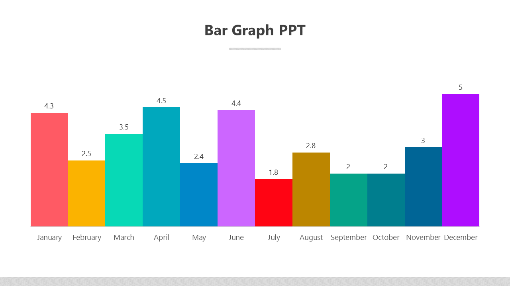
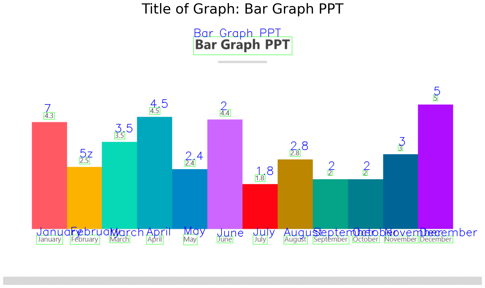
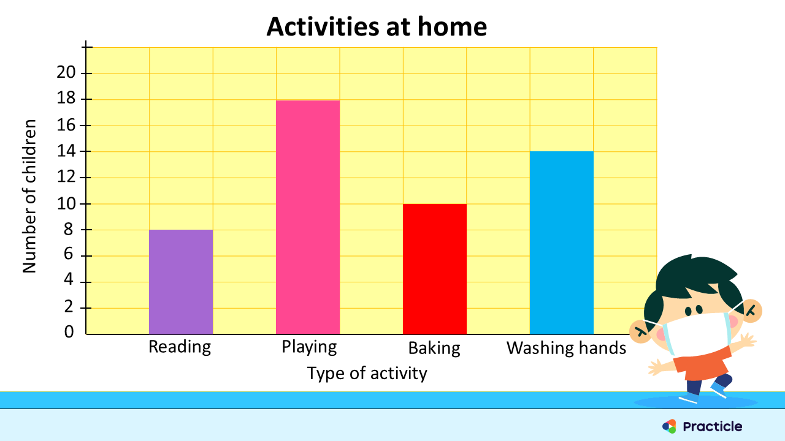
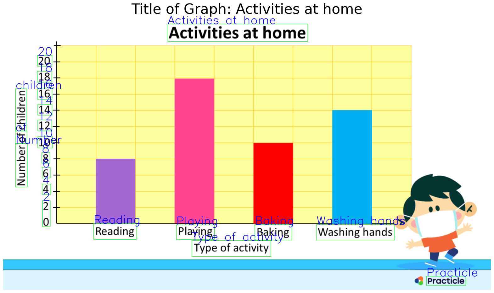
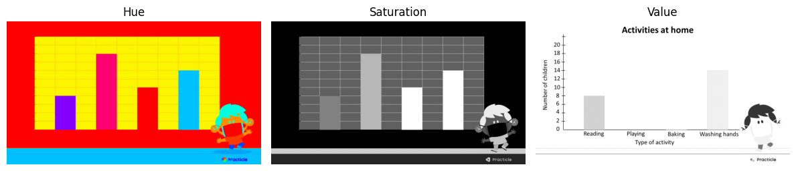
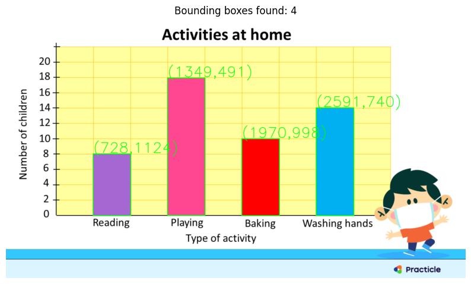

# Graph2Table April 2025

- [Graph2Table April 2025](#graph2table-april-2025)
  - [Environment](#environment)
  - [CNN Training](#cnn-training)
    - [Preprocessing](#preprocessing)
    - [Modeling](#modeling)
    - [Results](#results)
  - [Data Extraction](#data-extraction)
    - [image\_1.png](#image_1png)
    - [image\_2.png](#image_2png)

## Environment

- Python 3.10.16
- [Requirements](./requirements.txt)

## CNN Training

### Preprocessing

#### Cleaning

1. Fix permissions on directories
2. Convert all images to PNG and remove alpha channels as needed
3. Remove any invalid images -- none found
4. Deduplication of images -- remove obvious duplications; resized or different aspect ratios were left in the data set
5. Save finished data to `./datasets/dataset_clean`

#### Split Data Set

1. Check class balances:
   - flowchart: 546 - 18.41%
   - bargraph: 510 - 17.19%
   - piechart: 711 - 23.97%
   - linegraph: 497 - 16.76%
   - scatterplot: 702 - 23.67%
2. Split dataset into stratified 70/20/10 split
3. Write the split data out to `./datasets/dataset_train_validate_test/dataset_train` etc.
4. Build a "sanity check set" to verify that a simple model can be adequately trained -- 10 images from each class saved to `./datasets/dataset_tiny`

### Modeling

#### Model RV0

Build simple CNN with 2x conv2d layers and 1 fully connected layer

#### Sanity Check 

Build a simple model for checking the sanity of the dataset and model approach.

1. Train and check output -- Model failed to converge; this revealed that the basic model was missing a rescaling layer.
2. Add rescaling layer and retrain -- successful convergence validates that labels are acceptable and data is generally OK

#### RV0 Training & Analysis

Train model with 128x128 pixel images, Adam optimizer and default LR. Model converges and reaches reasonable accuracy

##### Check labels and image content.

Bargraph class contains three sub classes:

- Bar Graph
- Column Graph
- Stacked Bar Graph


Linegraph and Scatterplot class contains mixed data:

- Scatter plots with trend lines
- Line graphs with points
- Mixed graphs with multiple types of plots

Piechart contains many sub-plots.

##### Analyze Confusion Matrix

Large amount of confusion between linegraph and scatterplot - these two classes are often confused with each other.

**Top Confusions**

| True Class   | Predicted As   |   Count |
|--------------|----------------|---------|
| linegraph    | scatterplot    |      40 |
| scatterplot  | linegraph      |      27 |
| flowchart    | linegraph      |      18 |
| piechart     | bargraph       |      15 |
| bargraph     | scatterplot    |       8 |

**Model Performance**

| Metric    |   Value |
|-----------|---------|
| Accuracy  |  0.7099 |
| Precision |  0.7186 |
| Recall    |  0.7099 |
| F1 Score  |  0.7106 |

**Per-Class Metrics**

| Class       |   Precision |   Recall |   F1 Score |   Support |
|-------------|-------------|----------|------------|-----------|
| bargraph    |      0.7227 |   0.8431 |     0.7783 |       102 |
| flowchart   |      0.7292 |   0.6422 |     0.6829 |       109 |
| linegraph   |      0.4835 |   0.4444 |     0.4632 |        99 |
| piechart    |      0.959  |   0.8239 |     0.8864 |       142 |
| scatterplot |      0.6303 |   0.7376 |     0.6797 |       141 |

Reviewing images from the scatterplot and linegraph classes revealed that at 128x128 many line plots were broken into dot-like structures when reduced in resolution.

The next revision will use higher quality images (224x224) to see if this can reduce the confusion.

#### RV1 Training & Analysis

Use same model, optimizer and learning rates, but with increased image quality (224x224) to try to improve discrimination between scatter and line plots.

Theh large amount of confusion between linegraph and scatterplot persists, but has been reduced from a total of 67 between the two classes to 50. That's a reasonable improvement. Unfortunately this did not significantly improve the metrics overall.

**Top Confusions**

| True Class   | Predicted As   |   Count |
|--------------|----------------|---------|
| linegraph    | scatterplot    |      30 |
| scatterplot  | linegraph      |      20 |
| flowchart    | linegraph      |      19 |
| bargraph     | piechart       |       9 |
| piechart     | bargraph       |       8 |

**Model Performance**

| Metric    |   Value |
|-----------|---------|
| Accuracy  |  0.715  |
| Precision |  0.7162 |
| Recall    |  0.715  |
| F1 Score  |  0.7151 |

**Per-Class Metrics**

| Class       |   Precision |   Recall |   F1 Score |   Support |
|-------------|-------------|----------|------------|-----------|
| bargraph    |      0.8021 |   0.7549 |     0.7778 |       102 |
| flowchart   |      0.6476 |   0.6239 |     0.6355 |       109 |
| linegraph   |      0.5258 |   0.5152 |     0.5204 |        99 |
| piechart    |      0.8786 |   0.8662 |     0.8723 |       142 |
| scatterplot |      0.6774 |   0.7447 |     0.7095 |       141 |

#### Next Steps

Improving the resolution did not clear up the bottleneck in quality. Creating a curated set of 50 great examples from each class and training again is the next step. 

This did not significantly improve any of the metrics. Perhaps a larger curated set is needed.


##### Tiny Curated Set

**Top Confusions**

| True Class       | Predicted As     |   Count |
|------------------|------------------|---------|
| bargraph         | piechart         |       3 |
| flowchart        | line-scatterplot |       1 |
| flowchart        | piechart         |       1 |
| flowchart        | scatterplot      |       1 |
| line-scatterplot | scatterplot      |       5 |
| linegraph        | line-scatterplot |       5 |
| scatterplot      | line-scatterplot |       5 |

**Model Performance**

| Metric    |   Value |
|-----------|---------|
| Accuracy  |  0.5435 |
| Precision |  0.573  |
| Recall    |  0.5435 |
| F1 Score  |  0.534  |

**Per-Class Metrics**

| Class            |   Precision |   Recall |   F1 Score |   Support |
|------------------|-------------|----------|------------|-----------|
| bargraph         |      1      |   0.625  |     0.7692 |         8 |
| flowchart        |      1      |   0.6667 |     0.8    |         9 |
| line-scatterplot |      0.3125 |   0.5    |     0.3846 |        10 |
| linegraph        |      0      |   0      |     0      |         5 |
| piechart         |      0.6923 |   1      |     0.8182 |         9 |
| scatterplot      |      0      |   0      |     0      |         5 |

#### Transfer Learning

After several failed attempts at improving my simple CNN using error analysis techniques, I moved on to trying transfer learning using EficientNetB0. The model is a simple transfer model with frozen weights a global average pooling layer and a 64 unit dense layer for class discrimination.

The transfer model is extremely good at this task reaching an F1 score of 0.9764 with similar values for accuracy and precision. Similarly, the class precision is 96-100% in the validation data and slightly higher values for the test set.


##### Validation Set

**Top Confusions**

| True Class   | Predicted As   |   Count |
|--------------|----------------|---------|
| bargraph     | scatterplot    |       1 |
| flowchart    | scatterplot    |       2 |
| linegraph    | scatterplot    |       2 |
| piechart     | scatterplot    |       1 |
| scatterplot  | linegraph      |       5 |

**Model Performance**

| Metric    |   Value |
|-----------|---------|
| Accuracy  |  0.9764 |
| Precision |  0.9765 |
| Recall    |  0.9764 |
| F1 Score  |  0.9764 |

**Per-Class Metrics**

| Class       |   Precision |   Recall |   F1 Score |   Support |
|-------------|-------------|----------|------------|-----------|
| bargraph    |      1      |   0.9902 |     0.9951 |       102 |
| flowchart   |      0.9817 |   0.9817 |     0.9817 |       109 |
| linegraph   |      0.95   |   0.9596 |     0.9548 |        99 |
| piechart    |      0.993  |   0.993  |     0.993  |       142 |
| scatterplot |      0.9574 |   0.9574 |     0.9574 |       141 |

##### Transfer Learning Test Set

**Top Confusions**

| True Class   | Predicted As   |   Count |
|--------------|----------------|---------|
| flowchart    | piechart       |       1 |
| flowchart    | scatterplot    |       1 |
| linegraph    | scatterplot    |       2 |
| scatterplot  | linegraph      |       2 |

**Model Performance**

| Metric    |   Value |
|-----------|---------|
| Accuracy  |  0.9798 |
| Precision |  0.98   |
| Recall    |  0.9798 |
| F1 Score  |  0.9798 |

**Per-Class Metrics**

| Class       |   Precision |   Recall |   F1 Score |   Support |
|-------------|-------------|----------|------------|-----------|
| bargraph    |      1      |   1      |     1      |        51 |
| flowchart   |      1      |   0.9636 |     0.9815 |        55 |
| linegraph   |      0.96   |   0.96   |     0.96   |        50 |
| piechart    |      0.9861 |   1      |     0.993  |        71 |
| scatterplot |      0.9577 |   0.9714 |     0.9645 |        70 |

### Results

The best model by far is [`models/cnn_v3_best.keras`](./models/cnn_v3_best.keras). This model uses transfer learning and manages roughly 98% accuracy. The precision and recall values are highly aligned and the confusion matrix validates that very few  confusions and the earlier problem of linegraph-scatterplot is nearly resolved with a grand total of 6 confusions. This is still a leading category of confusion, but the problem is negligible.

#### Overall Performance

| Model             | Accuracy | Precision | Recall | F1 Score |
| ----------------- | -------- | --------- | ------ | -------- |
| RV0               | 0.7099   | 0.7186    | 0.7099 | 0.7106   |
| RV1               | 0.7150   | 0.7162    | 0.7150 | 0.7151   |
| Tiny Curated      | 0.5435   | 0.5730    | 0.5435 | 0.5340   |
| Transfer Learning | 0.9798   | 0.9800    | 0.9798 | 0.9798   |


#### Top Confusions

| Model             | True Class       | Predicted As     | Count |
| ----------------- | ---------------- | ---------------- | ----- |
| RV0               | linegraph        | scatterplot      | 40    |
|                   | scatterplot      | linegraph        | 27    |
|                   | flowchart        | linegraph        | 18    |
|                   | piechart         | bargraph         | 15    |
|                   | bargraph         | scatterplot      | 8     |
| RV1               | linegraph        | scatterplot      | 30    |
|                   | scatterplot      | linegraph        | 20    |
|                   | flowchart        | linegraph        | 19    |
|                   | bargraph         | piechart         | 9     |
|                   | piechart         | bargraph         | 8     |
| Tiny Curated      | linegraph        | line-scatterplot | 5     |
|                   | scatterplot      | line-scatterplot | 5     |
|                   | line-scatterplot | scatterplot      | 5     |
|                   | bargraph         | piechart         | 3     |
|                   | flowchart        | line-scatterplot | 1     |
|                   | flowchart        | piechart         | 1     |
|                   | flowchart        | scatterplot      | 1     |
| Transfer Learning | linegraph        | scatterplot      | 2     |
|                   | scatterplot      | linegraph        | 2     |
|                   | flowchart        | piechart         | 1     |
|                   | flowchart        | scatterplot      | 1     |

#### Per-Class Metrics

| Model             | Class            | Precision | Recall | F1 Score | Support |
| ----------------- | ---------------- | --------- | ------ | -------- | ------- |
| RV0               | bargraph         | 0.7227    | 0.8431 | 0.7783   | 102     |
|                   | flowchart        | 0.7292    | 0.6422 | 0.6829   | 109     |
|                   | linegraph        | 0.4835    | 0.4444 | 0.4632   | 99      |
|                   | piechart         | 0.9590    | 0.8239 | 0.8864   | 142     |
|                   | scatterplot      | 0.6303    | 0.7376 | 0.6797   | 141     |
| RV1               | bargraph         | 0.8021    | 0.7549 | 0.7778   | 102     |
|                   | flowchart        | 0.6476    | 0.6239 | 0.6355   | 109     |
|                   | linegraph        | 0.5258    | 0.5152 | 0.5204   | 99      |
|                   | piechart         | 0.8786    | 0.8662 | 0.8723   | 142     |
|                   | scatterplot      | 0.6774    | 0.7447 | 0.7095   | 141     |
| Tiny Curated      | bargraph         | 1.0000    | 0.6250 | 0.7692   | 8       |
|                   | flowchart        | 1.0000    | 0.6667 | 0.8000   | 9       |
|                   | linegraph        | 0.0000    | 0.0000 | 0.0000   | 5       |
|                   | piechart         | 0.6923    | 1.0000 | 0.8182   | 9       |
|                   | scatterplot      | 0.0000    | 0.0000 | 0.0000   | 5       |
|                   | line-scatterplot | 0.3125    | 0.5000 | 0.3846   | 10      |
| Transfer Learning | bargraph         | 1.0000    | 1.0000 | 1.0000   | 51      |
|                   | flowchart        | 1.0000    | 0.9636 | 0.9815   | 55      |
|                   | linegraph        | 0.9600    | 0.9600 | 0.9600   | 50      |
|                   | piechart         | 0.9861    | 1.0000 | 0.9930   | 71      |
|                   | scatterplot      | 0.9577    | 0.9714 | 0.9645   | 70      |

#### Inference Code Testing

Running the model in Inference Mode shows extremely good results with all of the sampled 16 images identified correctly.


## Data Extraction

### image_1.png

Extract tabular data from the image below



#### Part A - Extract and Print Title & Bounding Boxes

The title was extracted using `easyocr` by loading the image, resizing it and converting to gray scale and then using the easyocr `readetext` class. Several iterations were required to find the appropriate pre-processing filters and parameters for easyocr. Adjusting the contrast and manipulating the width_ths values to accurately separate values on the X-Axis was required.

```
results = reader.readtext(gray, 
                          contrast_ths=0.3, # try to improve recognizing small digits
                          adjust_contrast=0.5, 
                          paragraph=False,
                          decoder='beamsearch', # less greedy decoder; try to separate x-axis labels
                          width_ths=.35, # less aggressive merging of words
                          rotation_info=[90, 180 ,270]) # allow any possible rotation (good for y-axis)
```



Ultimately, no single configuration could accurately identify all of the text. Sometimes the month names were garbled or merged into a single string, and at other times, the data labels were interpreted as characters such as "U" or "~". The best version has an error in February and labels the value as "5z" instead of 2.5.

#### Part B - Extract CSV Data

The data was extracted by searching the OCR results for month names and numerical values. Those values were sorted by using the midpoint of the top left and bottom right X values. Based on the midpoint for the labels and the values, the two sets of data could be zipped together and output as a [CSV](./assets/image_1.csv).

| month        | value  |
| ------------ | ------ |
| January      | 7      |
| **February** | **5z** |
| March        | 3.5    |
| April        | 4.5    |
| May          | 2.4    |
| June         | 2      |
| July         | 1.8    |
| August       | 2.8    |
| September    | 2      |
| October      | 2      |
| November     | 3      |
| December     | 5      |

No further processing was required of the image. 

### image_2.png

Extract tabular data from the image below



#### Part A - Extract and Print Title & Bounding Boxes

The title, X and Y axis values and categories were extracted using `easyocr`. This was rather challenging and many iterations were required to determine the appropriate parameters to extract the text values. To make this task easier, the image was enlarged and a gaussian blur was applied to help reduce noise that was confusing the text extraction.



The most relevant OCR parameters that was required was the `rotation_info=[270]`. This feature allowed accurate extraction of the Y-axis title. The Y-axis was extracted as three separate bounding boxes and needed to be reassembled based sorting the y values for each bounding box.

The X-axis title was similarly difficult to extract because there were two extracted text that fell under the category labels: "Type of activity", "Practicle".  Sorting the text by Y value and taking the lowest two provided those labels. I had to manually choose the upper most to provide the X-axis label.

Extracting the Y-axis values was relatively easy by filtering for results that started with a digit.

The various text boxes were recorded using the mid-point X, Y value for each.

#### Part B - Extract Bar Height Data

Extracting the height of the bars proved to be exceptionally challenging. Straight detection of contours was confounded by the yellow background grid creating odd shaped blobs that could not be easily differentiated.

To solve this, the image was converted in to hue, saturation and value images. 



The hue and saturation images proved to be the most data rich for this project. By masking the saturation image values that were tweaked to provide just the non-yellow portions and the highly saturated portions of the image. Those images were logically and'ed together to provide a mask that contained only bars and a bit of the cartoon character.


This resulted in four, well defined bounding boxes that were labeled with the X, Y top corner coordinates.



Using the midpoint values of the Y-Axis values recorded earlier, the height of the bars were matched with the closest matching label.

```PYTHON
# match bounding boxes Y value to nearst match in y_value axis list

csv_data = []
for bi, b in enumerate(boxes):
    y = b[1]
    last = 1e15
    my_idx = 0
    for i, v in enumerate(y_vals):
        this = abs(y - v[2])
        if this <= last:
            last = this
            my_idx = i
        
    print(f'label: {x_labels[bi][0]} y: {y}, v: {y_vals[my_idx][0]}')
    csv_data.append((x_labels[bi][0], y_vals[my_idx][0]))
    
```
#### Part B - Write CSV Data

The CSV data was written to a file using the X and Y labels for column headers: [image_2.csv](./assets/image_2.csv)

| Type of activity | Number of children |
|------------------|--------------------|
| Reading          | 8                  |
| Playing          | 18                 |
| Baking           | 10                 |
| Washing hands    | 14                 |
